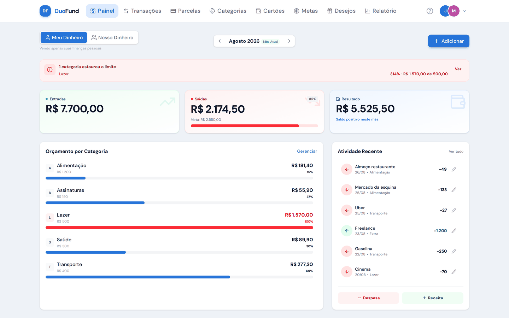
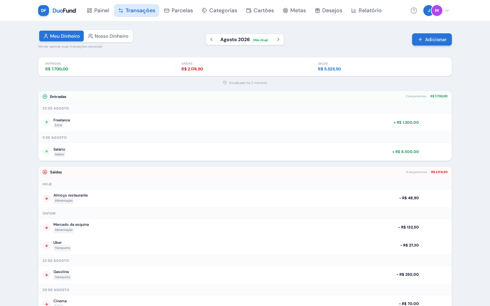
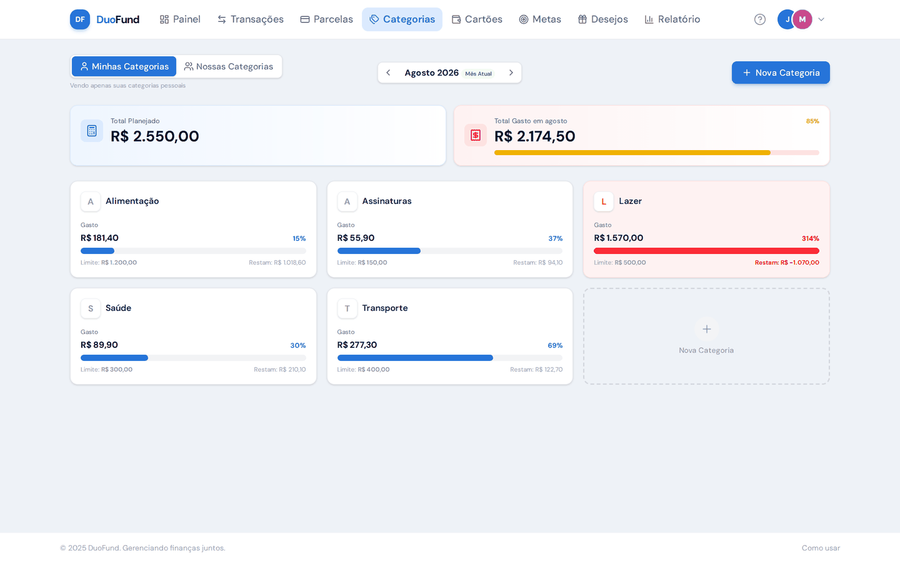
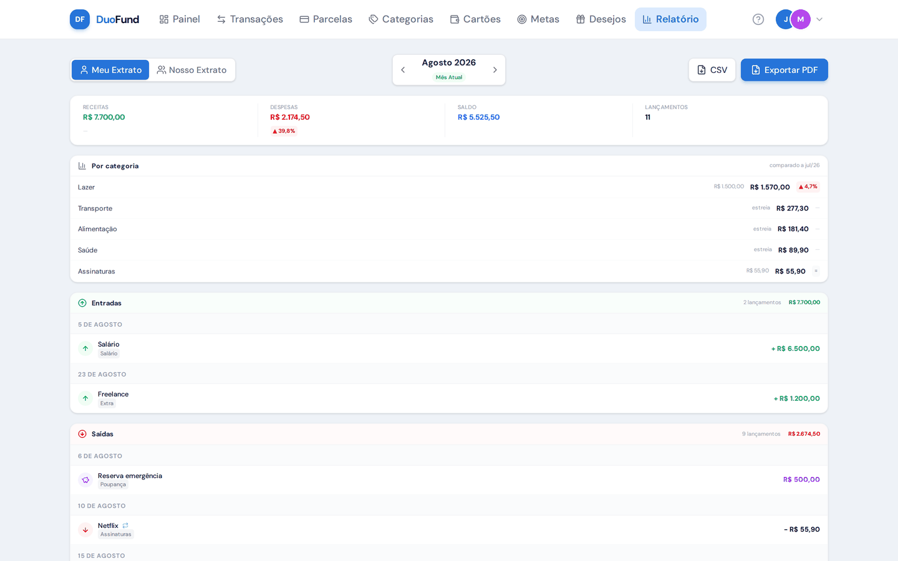
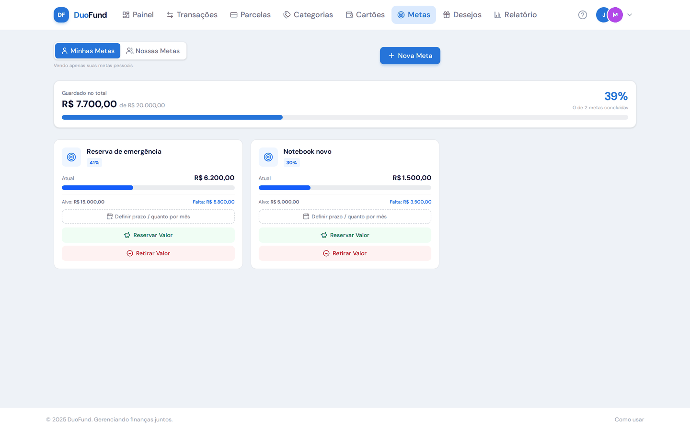
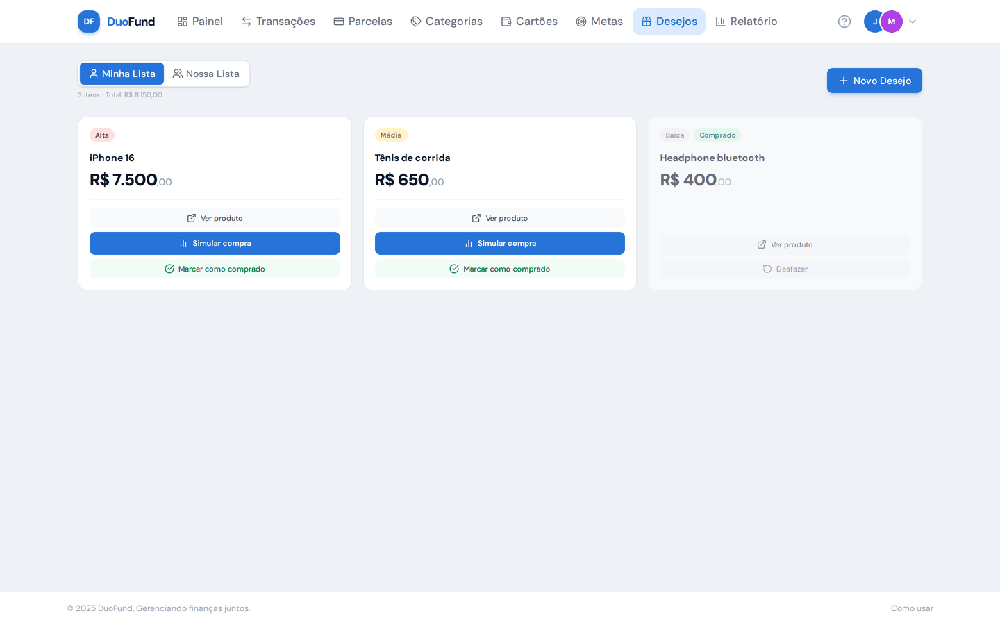
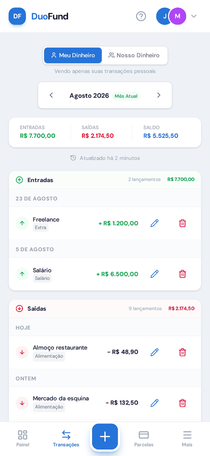
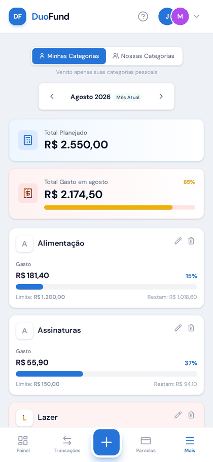

<div align="center">

# DuoFund

**Finanças a dois, sem complicação.**

Um app de finanças pessoais para casais, onde cada um enxerga o próprio dinheiro
e os dois enxergam o dinheiro do casal — sem misturar as duas coisas.

[](https://github.com/jeffersonrucu/duofund/actions/workflows/ci.yml)


</div>

---

## O problema

App de finanças para casal costuma escolher um dos dois extremos: ou tudo é
compartilhado — e você perde a privacidade do seu dinheiro — ou nada é, e a
conta conjunta vira uma planilha à parte.

O DuoFund resolve com **escopo**. Toda transação, categoria, meta, cartão e
desejo nasce em uma de duas visões:

| | |
|---|---|
| **Meu dinheiro** (`personal`) | Só você vê |
| **Nosso dinheiro** (`shared`) | Os dois veem, com o nome de quem lançou |

A visão ativa persiste entre as páginas, e um mesmo modelo nunca vaza de uma
para a outra. Quando você registra uma **receita compartilhada**, o app cria
automaticamente a despesa espelho "Transferido para conta conjunta" na sua
conta pessoal — porque aquele dinheiro saiu de você e entrou no bolo comum.

## Telas

<table>
<tr>
<td width="50%"><br><sub><b>Painel</b> — resumo do mês, orçamento por categoria e alerta de estouro</sub></td>
<td width="50%"><br><sub><b>Transações</b> — entradas e saídas agrupadas por data</sub></td>
</tr>
<tr>
<td><br><sub><b>Orçamento</b> — limite por categoria com progresso</sub></td>
<td><br><sub><b>Relatório</b> — comparativo com o mês anterior, export CSV e PDF</sub></td>
</tr>
<tr>
<td><br><sub><b>Metas</b> — progresso, ritmo de poupança e previsão</sub></td>
<td><br><sub><b>Desejos</b> — lista com prioridade e simulador de compra</sub></td>
</tr>
</table>

<details>
<summary><b>No celular</b> (o app é mobile-first)</summary>
<br>
<p align="center">




</p>
</details>

## O que faz

- **Transações** com receita, despesa e reserva; recorrentes e parceladas
- **Orçamento** por categoria, com aviso no painel a partir de 80% do limite
- **Metas** com plano por valor mensal ou por data-alvo, e previsão de conclusão
  comparada ao ritmo real
- **Cartões** e agrupamento de parcelas futuras
- **Lista de desejos** com prioridade e simulador de "cabe no meu mês?"
- **Relatório** mensal com comparativo contra o mês anterior, export CSV
  (abre certo no Excel pt-BR) e PDF
- **Convite do parceiro** por link assinado
- **PWA** instalável, com 2FA opcional

## Converse com suas finanças pelo Claude

O projeto inclui um **servidor MCP** que expõe a conta para assistentes de IA.
Na prática, dá para perguntar *"quanto gastei com mercado esse mês?"* ou dizer
*"lança 80 reais de farmácia"* direto no Claude.

São 14 ferramentas cobrindo resumo, categorias, metas, transações e desejos —
todas respeitando o mesmo escopo `personal`/`shared` do app.

```jsonc
// .claude/mcp.json
{
  "mcpServers": {
    "duofund": {
      "command": "node",
      "args": ["./mcp/server.js"],
      "env": {
        "DUOFUND_URL": "https://seu-dominio",
        "DUOFUND_TOKEN": "seu-token"
      }
    }
  }
}
```

A API por trás fica em `/api/mcp/*`, autenticada por bearer token com
`hash_equals` e limitada a 60 requisições por minuto.

## Stack

| | |
|---|---|
| Backend | PHP 8.2+, Laravel 12, Livewire Volt, Fortify |
| Frontend | Tailwind CSS 4, Alpine.js, Lucide (SVG server-side) |
| Build | Vite 7 |
| Banco | MySQL 8 |
| Testes | Pest 4 · PHPStan/Larastan nível 5 |

Nenhuma página faz requisição para fora: fontes, ícones e JS são todos
servidos pelo próprio domínio.

## Rodando localmente

```bash
git clone git@github.com:jeffersonrucu/duofund.git
cd duofund

cp .env.example .env
docker compose up -d
docker compose exec laravel.test composer install
docker compose exec laravel.test php artisan key:generate
docker compose exec laravel.test php artisan migrate --seed
docker compose exec laravel.test npm ci && npm run build
```

Acesse **http://localhost:8080**.

Para ver o app com dados de demonstração (é o que aparece nas telas acima):

```bash
docker compose exec laravel.test php artisan db:seed --class=TestDataSeeder
```

> Entre com **test@example.com** / **password**.

## Testes e qualidade

```bash
docker compose exec laravel.test php artisan test      # 143 testes
docker compose exec laravel.test composer analyse      # PHPStan nível 5
docker compose exec laravel.test composer check        # os dois
```

Alguns testes existem por motivos específicos que valem menção:

- **`NoLazyLoadingTest`** renderiza todas as páginas **com dados** nos dois
  escopos. `Model::preventLazyLoading()` só arma o guard em resultado com mais
  de uma linha, então página vazia não acusa N+1 nenhum.
- **`PageSmokeTest`** renderiza as 16 páginas que servem HTML. Como os ícones
  são SVG resolvidos em tempo de render, um nome errado vira exceção — não um
  espaço em branco silencioso.
- **`MonthNavigationTest`** ataca a URL com valores inválidos: `view` e
  `currentMonth` são estado exposto na query string.

## Deploy

`git push` na `master` dispara a esteira em `.github/workflows/ci.yml`:

1. Testes e PHPStan no **PHP 8.3** (o Pest 4 exige `^8.3`)
2. `composer install --no-dev` no **PHP 8.2**, a versão do servidor — se alguma
   dependência de produção exigir mais que isso, o build falha aqui em vez de
   derrubar o site
3. `rsync` da aplicação e do `vendor`, migrations e recache
4. Verificação de que o site respondeu 200

O `vendor` de produção é construído sem dependências de desenvolvimento de
propósito: o Pest exige PHP `^8.3` e elevaria o piso de versão do servidor
mesmo sem nunca rodar lá.

Backup do banco roda por cron (`scripts/backup-db.sh`), em shell puro — em
hospedagem compartilhada o `proc_open` costuma vir bloqueado, o que inviabiliza
as soluções que chamam o `mysqldump` pelo PHP.

## Estrutura

```
app/
├── Enums/PaymentMethod.php          # pix, cartão, boleto — rótulo e ícone juntos
├── Livewire/Concerns/               # navegação de mês e alternância de escopo
├── Models/Concerns/ScopedToView.php # o filtro personal/shared, em um lugar só
├── Services/
│   ├── TransactionMirrorService.php # a despesa espelho da receita compartilhada
│   └── MonthlySummaryService.php    # fonte única dos totais do mês
└── Support/Money.php                # entrada em pt-BR → decimal

resources/views/livewire/pages/      # as telas, em Livewire Volt
mcp/server.js                        # servidor MCP
```

## Licença

Ainda não definida — sem uma licença explícita, todos os direitos são
reservados.
